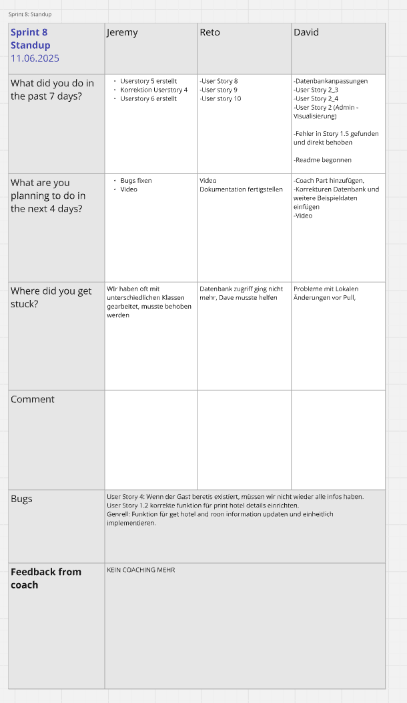

# FS25 Anwendungsentwicklung mit Python

## General
- **Hotel reservation system:** 
- **Germann David, Lutz Reto, Nathan Jeremy:** 
- **Group B-10**
- **15.July 2025**
- **Business Artificial Intelligence  / Anwendungsentwiklung Python:** 

## Abstract
Im Rahmen des Moduls FS25 Anwendungsentwicklung mit Python haben wir ein Hotel-Reservierungssystem entwickelt, das zentrale Funktionen wie Hotelsuche, 
Zimmerverfügbarkeit, Buchung und Hotelverwaltung in einer Three-Layer-Architektur erstellt. Aufbauend auf einem bereits vorhandenen Datenbankschema 
setzten wir eine Three-Layer-Architektur um, bestehend aus Benutzeroberfläche, Business-Logic- und Data-Access-Layer. Die Anwendung wird in Python 3.12 
entwickelt, nutzt SQLite, sowie eine kleine App für Demo-Zwecke. 

Das Projekt zeigt, wie sich mit klarer Schichtentrennung saubere Wartbarkeit und schnelle Fehlererkennung realisieren lassen 
und wie ein kleines Team ohne Vorwissen in kurzer Zeit ein voll funktionsfähiges Buchungssystem aufbauen kann. Neben vertieftem Verständnis für OOP und  relationale Datenbanken (repetierung) gewannen wir wertvolle Erfahrungen in agiler Zeitplanung und Projektumsetzung. 

## Table of Contents
- [Introduction](#introduction)
  - [Background](#background)
  - [Objectives](#objectives)
  
- [Übersicht](#übersicht)
  - [Projektstruktur](#projekt-struktur)
  - [Klassendiagramm](#klassendiagramm)
    
- [Methods](#methods)
  - [Ansatz und Methodik](#ansatz-und-methodik)
  - [Tools, Frameworks und Technologien](#tools-frameworks-und-technologien)
    
- [Results](#results)
  - [Zentrale Erkenntnisse](#zentrale-erkenntnisse)
  - [Beobachtungen](#beobachtungen)
    
- [Discussion](#discussion)
  - [Interpretation der Ergebnisse](#interpretation-der-ergebnisse)
  - [Herausforderungen](#herausforderungen)
  - [Zielerreichung](#zielerreichung)
    
- [Conclusion](#conclusion)
  - [Zusammenfassung zentraler Erkenntnisse](#zusammenfassung-zentraler-erkenntnisse)
  - [Was ging gut](#was-ging-gut)
  - [Was hätte man besser machen können](#was-hätte-man-besser-machen-können)
    
- [Abschliessende Worte](#abschliessende-worte)
- [References](#references)

## Introduction
- Background / context
- Problem statement 
- Objectives
- Structure of the report

### Background 
Im vergangenen Semester entwickelten wir eine Datenbank für ein Hotelreservierungssystem. 

In diesem Semester bauten wir darauf auf und realisierten ein vollfunktionsfähiges System zur 
Hotelreservierung, angelehnt an Plattformen wie Booking.com. Dabei stellten sich verschiedene 
Herausforderungen, insbesondere im Hinblick auf eine durchdachte Projektstruktur sowie eine 
effiziente technische Umsetzung.

Für eine saubere und wartbare Entwicklung kamen verschiedene Methoden der Softwareentwicklung 
zum Einsatz. Auch die Zusammenarbeit im Team war ein zentraler Faktor. Obwohl es zeitlich nicht 
immer einfach war, gelang es uns in der Regel, einmal pro Woche ein Scrum-Meeting durchzuführen, 
in dem wir Aufgaben verteilten und den Projektfortschritt besprachen.

Zu Beginn lag der Fokus stärker auf dem theoretischen Austausch, unter anderem durch wöchentliche 
Übungen. Mit dem Start der eigentlichen Implementierungsphase arbeiteten wir zunehmend strukturiert 
und konnten durch die regelmäßigen Meetings unsere Arbeit gut koordinieren.

### Objectives

Das zentrale Ziel unserer Projektes war es, ein vollständig laufendes Hotel-Reservierungssystem bereitzustellen. Dieses Tool muss in der Lage sein, diverse Aspekte wie Hotelsuche, Preis­berechnung, Buchungen und auch Datenbankanpassungen zu handeln.

Neben diesen Vorgaben, sollten wir uns auch an gängige Prinzipien wie KISS (KEEP IT SIMPLE, STUPID) und die Three-Layer-Architecture halten.
KISS bedeutet, dass wir die Lösungen (resp. den Code) so einfach wie möglich halten und unnötig komplexe Codes so gut wie möglich Vermeiden. 
In der Three-Layer-Architecture geht es darum, dass Präsentationsschicht (UI), Logikschicht (Business Logic) und Datenschicht (Data Access) klar 
getrennt sind.Somit bleibt der Code übersichtlich. Auch wird es einfacher in Zukunft Anpassungen zu machen, da man relativ schnell weiss, in welcher 
Layer man welche Anpassungen genau machen soll. 

Natürlich ist auch die Dokumentation (readme File) sowie das Projektmanagement (GANTT, Scrum), wie auch im letzten Jahr, wieder ein zentraler Punkt des Moduls.

## Übersicht
### Projekt Struktur

Unser Code gliedert sich in mehrere klar voneinander getrennte Schichten/Layers. Jede dieser Layers übernimmt genau einen Aufgabenbereich. Der Austausch zwischen den Schichten läuft über sauber definierte Klassen und Module. Im Folgenden stellen wir die einzelnen Ebenen kurz vor:

- Database Layer: Enthält die SQLite-Datei database/hotel_reservation_sample.db. Sie ist die einzige Stelle, an der Daten physisch gespeichert werden; alle anderen Schichten greifen lediglich über definierte Schnittstellen darauf zu.
- Model Layer: Definiert die Domänen­klassen wie Hotel, Room, Booking … – jedes Objekt steht genau für einen Datenbank­eintrag und kennt nur seine Attribute. Damit bilden die Models das gemeinsame „Daten-Vokabular“ für BLL und DAL.
- Data Access Layer: Bietet pro Entität eine DAO-Klasse (HotelDAO, BookingDAO …), die sämtliche CRUD- Operationen kapselt. Dadurch wird in keinem anderen Ort im Code direkt auf die Datenbank zugegriffen.
- Business Logic Layer: Enthält Services wie hotel_manager oder booking_manager. Sie koordinieren Workflows, prüfen Verfügbarkeit, berechnen Preise, validieren Eingaben und rufen dabei ausschliesslich die DAO-Methoden des DAL auf.
- UI Layer: Die UI-Layer verarbeitet User Inputs. Da wir nicht mit Jupyter Notebooks arbeiten, werden die Inputs jedoch über die app.py geregelt

### Klassendiagramm

## Methods
- Approach and methodology
- Tools, frameworks, and technologies used

### Ansatz und Methodik
Zu Beginn des Moduls, haben wir uns darauf geeinigt, noch etwas warten, bevor wir mit dem Projekt anfangen. 
Dies lag zum einen daran, dass wir nur zu dritt, anstatt zu viert in der Projektgruppe sind.
Ein weiterer Punkt, der dafür sprach, dass wir noch etwas warten mit der Umsetzung war, dass wir niemanden mit Programmierkenntnissen in unserer Gruppe haben.
Wir wollten also mit der Umsetzung jeweils warten bis wir das entsprechende Thema entweder im Unterricht behandelt haben.
Ein weiterer Punkt der dafür Sprach, dass wir vorerst warten sollen, war dass wir auch in den Modulen Machine Learning und Wissensrepräsentation Projekte hatten. 
Wir haben uns also dazu entschlossen in den anderen zwei Modulen so viel wie möglich vorarbeiten, dass wir dann genug Zeit für Python haben. 
 
Mitte April haben wir dann jedoch gemerkt, dass diese Rechnung nicht aufgehen wird. Wir haben uns also in der Blockwoche vom 14. April zusammengesetzt und unser GANTT-Digramm erstellt. 
Auch haben wir uns dazu entschieden, wie beim letzten Projekt wieder nach SCRUM- Methode zu arbeiten. Wir haben uns also alle in der Gruppe jeden Montag Abend 30 Minuten fürs Sprint Plannig,
jeden Mittwoch nach der Schule 30 Minuten für den Sprint Standup und jeden Sonntag Abend 60 Minuten für das Sprint Review eingeplant. Natürlich haben wir uns auch fast täglich via Whatsapp oder Teams ausgetausch und uns gegenseitig bei Probleme geholfen.
Weiter haben wir eingeplant, dass wir nach jedem "Story Stack" (siehe GANTT-Diagramm/Umsetzung) zwei Tage eingeplant haben, um die Codes zu testen und ggf. zu korrigieren. 

Im Laufe des Projektes, haben wir uns stets versucht an die Plannung welche wir ursprünglich erstellt haben zu halten. Dies klappt anfänglich auch sehr gut. In den letzten zwei Sprints
wurde das ganze jedoch etwas kritisch, da sich der Backlog zu häufen began. Dies lag vor allem an der Abgabe vom Projekt Wissensräpresentation, welches vom Umfang her noch grösser war als das Python Projekt.

Wie man dem Screenshot von unserem letzten Sprint Standup sehen kann, hatten wir noch zu viele offene Punkte. Uns waren Bugs bekannt und auch die DB erforderte noch Anpassungen. Zu allem Übel, stand auch noch die Angabe eines anderen Projektes bevor. 

### Tools, Frameworks und Technologien

Für die Umsetzung des Projekts haben wir viele verschiedene Programme verwendet. Für das Programm
selbst haben wir die Programmiersprache Python 3.12 (inkl. Libraries wie pandas) verwendet. Als Entwicklungsumgebung haben wir 
uns auf PyCharm von Jetbrains geeinigt, wir hätten auch das jupiter Notebook Deepnote verwenden 
können. Uns sprach jedoch das Design und die Handhabung von PyCharm viel mehr an. Auch fanden wir das Prinzip mit der GitHub anbindung und den dadurch entstandenen Möglichkeiten sehr spannend.
Vorallem beeindruckte uns die Nachvollziehbarkeit im GitHub. Wir konnten zu jeder Zeit sehen, wer was genau angepasst oder neu hinzugefügt hat. 

Die Datenbank selber haben wir von unseren Dozenten zur vefügung gestellt bekommen. Diese läuft mit SQLite 3 und wurde im Verlauf des Projekts bearbeitet. Diese Aufgabe hat primär unser Datenbankspezialist David Germann übernommen. 

Begonnen haben wir aber mit VisualParadigm, hier konnten wir unsere Modelle korrekt visualisieren. Der Vorteil daran war, dass wir uns stehts an das VisualParadigm halten konnten. 

## Results
- Key findings
- Charts, tables, and important observations

Im Laufe des Projekts konnten wir ein funktionierendes Hotelreservierungssystem programmieren, welches 
die wichtigsten Anforderungen erfüllt. Die Anwendung erfüllt unter anderem:
- Hotelsuche nach Stadt, Sternebewertung, Anzahl der Gäste und Verfügbarkeit
- Anzeige von Hoteldetails inklusive Adresse und Sterne
- Verwaltung von Hotels (Hinzufügen, Bearbeiten, Löschen)
- Visualisierung von Daten (pandas, xlswriter)

### Zentrale Erkenntnisse:
  - Die Trennung von Datenzugriff (DataAccessLayer), Geschäftslogik (BusinessLogicLayer) und 
    Benutzerschnittstelle(UI) hat sich als sehr nützlich herausgestellt, auch wenn es am Anfang kompliziert 
    schien.
  - Durch die modulare Struktur konnten wir parallel arbeiten und einzelne Komponenten unabhängig entwickeln 
    und testen.
  - Die Nutzung von Objektorientierung (z. B. für Hotel, Adresse, Buchung) hat den Umgang mit komplexen 
    Datenmodellen vereinfacht.
  - Damit wir alle Userstories jeweils schnell testen konnten, haben wir zudem (mit klarer Hilfe von Chatgpt) eine grobe 
    Konsolenbasierte app (app.py) entwickelt. Hier konnten wir nun direkt mehrere Userstories testen und auch direkt Angaben
    für unsere Coaches ausgeben. 
    
    
### Beobachtungen:
  - Die Implementierung der dreischichtigen Architektur führte zu einer klaren Trennung der Verantwortlichkeiten.
    Wir haben die Userstories jeweils im Voraus aufgeteilt (je nach Kapazität der Teammitglieder). So war klar, dass wenn jemand eine Userstory implementiert,
    diese Person gerade zuständig für alle drei Layers ist. 
  - Die Verwendung von SQLite3 erwies sich als effiziente Lösung für die Datenbank und CRUD Operationen.
  - Die Implementierung von Fehlerbehandlung und Eingabevalidierung verbesserte die Benutzerfreundlichkeit.
  - Die Verwendung von Git für die Versionskontrolle unterstützte die parallele Entwicklung im Team.

## Discussion
- Interpretation of the results
- Challenges encountered
- Were objectives achieved?

### Interpretation der Ergebnisse
Die im Projekt implementierten Funktionen zeigen, dass ein einfaches, aber effektives 
Hotelreservierungssystem mit den verwendeten Technologien erfolgreich umgesetzt werden kann. Die Hauptziele,
wie die Suche nach Hotels, Verwaltung von Hotels und Adressdaten sowie einfache Buchungslogik, konnten in 
funktionierender Form realisiert werden. Neben dem Three-Layer-Prinzip hat uns vorallem die und objektorientierte Umsetzung 
positiv auf Lesbarkeit, Testbarkeit und Erweiterbarkeit ausgewirkt.

### Herausforderungen
Während der Entwicklung traten verschiedene Herausforderungen auf:
- Adressverwaltung: Die Trennung von Hotel- und Adressdatenbanktabellen erforderte eine saubere Verknüpfung 
  und erhöhte zunächst die Komplexität im Code.
- Fehlermeldungen und Debugging: Einige Fehler, z. B. bei der Übergabe von Argumenten an Konstruktoren, 
  waren schwer zu identifizieren, insbesondere bei komplexeren Methoden.
- Klassen: Auch wenn wir uns zu beginn bereits auf die Verschiedene Klassen- und deren Attributen geeinigt haben,
  haben sich mier manchmal Fehler eingeschlichen. Als Beispiel hatten wir zum Beispiel das Attribut "price per night"
  in der Klasse Room, sowie auch in der Klasse RoomType geführt- was logischerweise zu diversen Problemen geführt hat und enorm
  mühsam zum beheben war. 
- Teamkoordination: Durch unterschiedliche Verfügbarkeiten im Team war es manchmal schwierig, kontinuierlich 
  im gleichen Tempo zu arbeiten. Die wöchentlichen Scrum-Meetings haben jedoch geholfen, Aufgaben zu klären 
  und Fortschritte zu sichern.

### Zielerreichung
Die meisten im Vorfeld gesetzten Ziele wurden erreicht:
- Die Suchfunktionen sind implementiert und getestet.
- Hotels können korrekt hinzugefügt, bearbeitet und gelöscht werden.
- Adressen werden eigenständig gespeichert und sind mit Hotels verknüpft.
- Prinzipien des Three-Layer-Prinzip wurden konstant eingehalten.
- KISS wurde umgesetzt (soweit es möglich war).
- OOP stand im Fokus, haben wir eingehalten. 

## Conclusion
- Summary of key findings
- Reflection: what went well and what could be improved

### Zusammenfassung zentraler Erkenntnisse
- Die Einführung einer modularen Schichtenarchitektur (UI, Business Logic, Data Access, Models) 
  hat zu sauberer Trennung von Verantwortlichkeiten geführt. Anfangs hat uns dies ein bisschen verwirrt und wir verstanden den Sinn dahinter nur bedingt. 
  Schnell wurde uns neben dem theorethischem Nutzen jedoch auch der praktische Nutzen klar, und wir wurden Fans dieser Struktur. 
- Auch verstehen wir nun den konkreten zusammenhang zwischen Python und SQL. Diverse Fragen welche wir uns beim letzten Projekt (SQL-Projekt) gestellt haben, konnten wir nun
  eigenständich umsetzen.
- Auch konnten wir durch die Teils sehr komplexen Datenbankabfragen direkt unsere SQL-Kenntnisse (wenn auch teils unfreiwillig) wieder auffrischen und sogar noch ausbauen. 
- Die Fehlerbehandlung, insbesondere bei Benutzereingaben, wurde systematisch ausgebaut.
- GitHub wurden für Versionskontrolle, Teamarbeit und Problemanalyse effizient genutzt. Auch wenn wir vor jedem Commit jeweils getestet haben, schlichen sich manchmal doch Fehler ein. 
  Hier konnten wir dann jeweils im GitHub schauen, was genau der Auslöser dafür sein konnte. 

### Was ging gut: 
- Git-Workflow wurde sinnvoll angewendet (Commit/Push/Pull, Branching, Konfliktlösung).
- Die Teamarbeit / die Kommunikation hat stets gut funktioniert.
- Wir konnten uns gut an die, im Unterricht, gelernten Konzepte halten. 
- Fehler wurden gemeinsam analysiert und lösungsorientiert behoben.
- Wir konnten neue Python-Kenntnisse anwenden (z. B. Properties, Klassenstruktur, 
  Try-Except-Blöcke).
- Trotz Herausforderungen mit der Datenbankanbindung wurde eine funktionierende 
  Lösung gefunden.

### Was hätte man besser machen können
- Datenbankzugriff zentralisieren: Mehr Wiederverwendung von Methoden im base_data_access, 
  um Redundanzen zu vermeiden.
- Validierungen früher implementieren (z. B. für Eingaben, Konsistenzprüfungen in model-Klassen).
- Projektstruktur standardisieren, z. B. einheitlichere Benennung, klarere Trennung von 
  Test- und Produktivdaten.
- Frühzeitigeres Testing: Einzelne Funktionen hätten mit Unit-Tests früher auf Fehler überprüft 
  werden können.
- Wir haben uns zu Beginn etwas zu viel Zeit gelassen. Wir wollten abwarten, bis wir alle Konzepte 
  gelernt haben. Im Nachhinein hätten wir früher beginnen sollen und einfach ausprobieren sollen

## Abschliessende Worte
Generell hat uns das Projekt enorm viel Spass gemacht. Auch wenn es anfänglich nach einer Herkulesaufgabe aussah,
konnten wir alle User Stories umsetzen, und sogar teilweise noch kleine "Easter-Eggs" einbauen (Excel Export, App, Logo). 

Unsere Gruppe war bereits seit dem letzten Semester enorm motiviert, bald Python lernen zu dürfen. Diese Motivation nahmen
wir mit ins laufende Semester. Es war teils enorm schwer unsere vordefinierte Timeline (GANTT-Diagramm) einzuhalten, gerade 
wenn wir aufgrund den anderen zwei Projekten bereits fast komplett ausgelastet waren. In solchen Momenten mussten wir uns 
gegenseitig an die Wichtigkeit dieses Moduls erinnern und uns auch gegenseitig motivieren, aushelfen und gute Worte zusprechen. 

## Appendix *(optional)*
- Raw data
- Code snippets
- Extra charts or figures

## References
- Full list of all sources (books, articles, websites)

